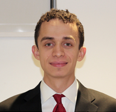

## Welcome
I work as a [Research Assistant](https://www.consumerfinance.gov/about-us/careers/students-and-graduates/) at the [Consumer Financial Protection Bureau](https://www.consumerfinance.gov/about-us/the-bureau/bureau-structure/research-markets-regulation/) in Washington DC. I graduated from Swarthmore College [with honors](https://www.swarthmore.edu/honors-program) in Economics and Psychology in May 2017. I am interested in behavioral finance and financial well-being research and plan to attend graduate school to earn a PhD in economics. I want to apply my research to help people take control over their financial lives.

 

### Professional Experience
##### Research Assistant at CFPB
##### Research Assistant at Yale University's [Applied Cooperation Team](https://act.yale.edu/people)
##### Research Assistant at Swarthmore College 
##### Resident Adviser at Swarthmore College
##### Microeconomics Teacher's Assistant at Swarthmore College
 

### Skills
##### Dataset analysis and cleaning
##### Stata
##### Python
##### C/C++
##### MATLAB
##### Web development and design (HTML, CSS, Javascript)
##### Implementing lab and field experiments
 

### Economics Coursework
##### Behavioral Economics Honors Seminar
##### Advanced Microeconomics Honors Seminar
##### Public Economics Honors Seminar
##### Econometrics
##### Intermediate Macroeconomics
 

### Psychology and Behavioral Science Coursework
##### Thinking, Judgment, and Decision-Making Honors Seminar
##### Behavioral Science and Public Policy
##### Research Design and Analysis
##### Cognitive Science
##### Developmental Psychology
 

### Math and Statistics Coursework
##### Real Analysis
##### Differential Equations
##### Multivariate Calculus
##### Linear Algebra
##### Statistical Methods
 

### Computer Science Coursework
##### Data Structures and Algorithms
##### Computer Systems
 

## More About Me

In my free time I enjoy volunteering as a math tutor at a local youth center in DC and singing bass in the [National Cathedral Choral Society](http://www.cathedralchoralsociety.org/chorus). 

Feel free to download my [CV](https://www.dropbox.com/s/rok02wsilwfyr9w/dbankoResume.docx?dl=0) and follow my [GitHub page](https://github.com/danielbanko) to keep up with my coding projects..

For any inquiries, please email <a href="mailto:daniel.bankoferran@gmail.com?" target="_top">daniel.bankoferran@gmail.com</a>.

<a class="LI-simple-link" href='https://www.linkedin.com/in/daniel-banko-ferran-4584b951?trk=profile-badge'>Daniel Banko-Ferran</a>

